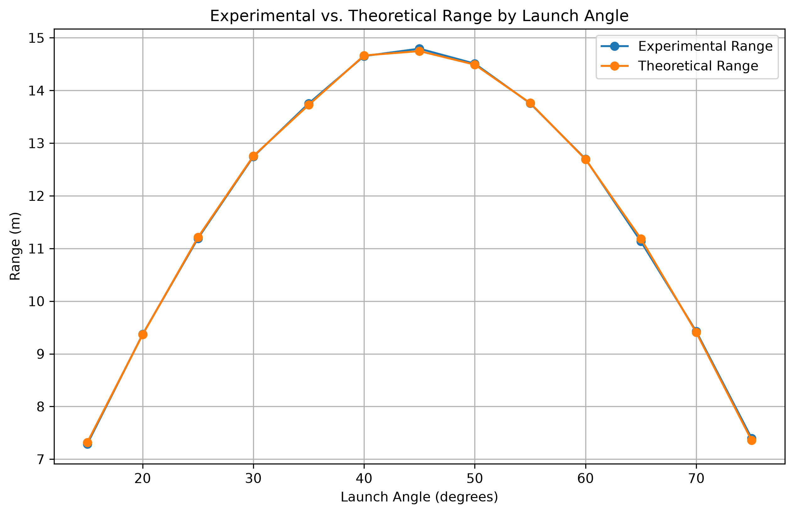
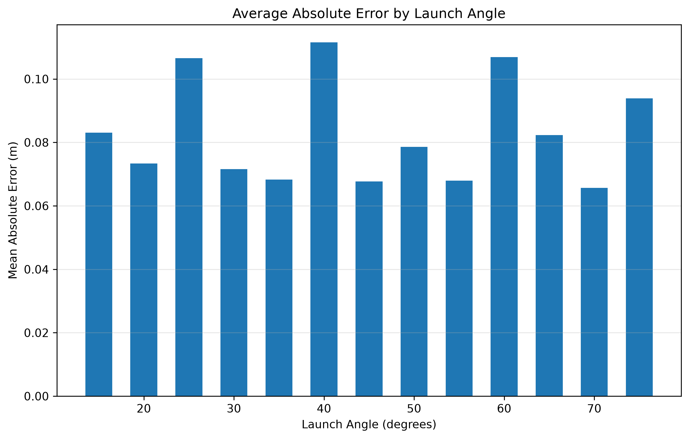
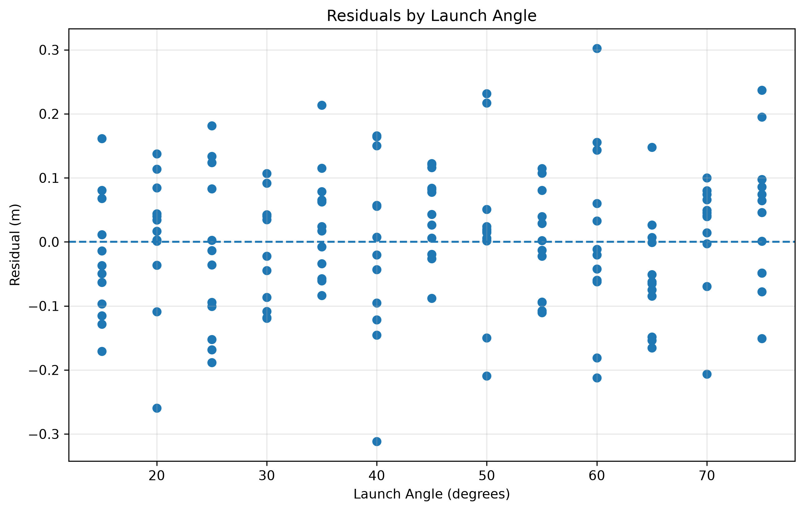
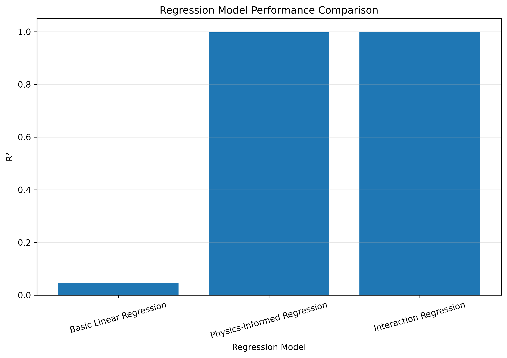

# Scientific Data Analysis Pipeline

## Project Overview

This project analyzes simulated projectile-motion data to investigate how accurately projectile trajectories can be modeled using classical kinematics and statistical/machine-learning methods.

The project combines physics, Python, statistics, SQL, and Power BI into an end-to-end scientific data analysis workflow.

## Research Question

How accurately can simulated projectile trajectories be modeled using classical kinematics, and what experimental factors contribute most to prediction error?

## Dataset

The dataset contains 156 simulated projectile-motion trials.

Variables include:

- `trial_id`
- `launch_angle`
- `initial_velocity`
- `flight_time`
- `range_x`
- `max_height`

## Tools & Technologies

- Python
- Pandas
- NumPy
- Matplotlib
- Scikit-learn
- SQLite
- SQL
- Power BI
- Git/GitHub

## Project Workflow

1. Data cleaning and validation
2. Exploratory data analysis
3. Theoretical projectile-motion modeling
4. Statistical analysis
5. Error and residual analysis
6. Regression modeling
7. SQL database analysis
8. Power BI visualization

## Theoretical Model

The ideal projectile range was calculated using:

`R = v0^2 * sin(2*theta) / g`

where:

- `R` = theoretical range
- `v0` = initial velocity
- `theta` = launch angle
- `g` = 9.81 m/s^2

## Results

The theoretical model produced:

- MAE: 0.0829 m
- RMSE: 0.1050 m

Regression models were also evaluated.

| Model | R2 | MAE (m) | RMSE (m) |
|---|---:|---:|---:|
| Basic Linear Regression | 0.0469 | 2.2082 | 2.5366 |
| Physics-Informed Regression | 0.9976 | 0.0973 | 0.1277 |
| Interaction Regression | 0.9984 | 0.0826 | 0.1049 |

## Key Findings

- The experimental range followed the expected projectile-motion pattern, increasing toward a launch angle near 45° and decreasing at higher angles.
- The theoretical model closely matched the simulated measurements, with an MAE of 0.0829 m and an RMSE of 0.1050 m.
- Physics-informed regression substantially outperformed the basic linear regression model.
- The interaction regression model achieved the strongest training performance, with R² = 0.9984, MAE = 0.0826 m, and RMSE = 0.1049 m.
- Residuals were generally distributed around zero without an obvious systematic trend across launch angles.

## Power BI Dashboard

The Power BI dashboard includes:

- Total number of trials
- Average experimental range
- Mean Absolute Error
- Root Mean Squared Error
- Experimental vs. theoretical range
- Error by launch angle
- Residual analysis
- Regression model comparisons

## Analysis Visualizations

### Experimental vs. Theoretical Range



### Average Absolute Error by Launch Angle



### Residual Analysis



### Regression Model Performance



## Project Structure

```text
data/
├── raw/
└── processed/

src/
├── data_cleaning.py
├── theoretical_model.py
├── regression_model.py
├── create_database.py
├── check_database.py
├── load_database.py
├── run_query.py
└── create_figures.py

sql/
├── create_tables.sql
└── analysis_queries.sql

notebooks/
tests/

figures/
├── range_vs_angle.png
├── error_by_angle.png
├── residuals.png
└── model_comparison.png

projectile_analysis.db
README.md
requirements.txt
.gitignore
